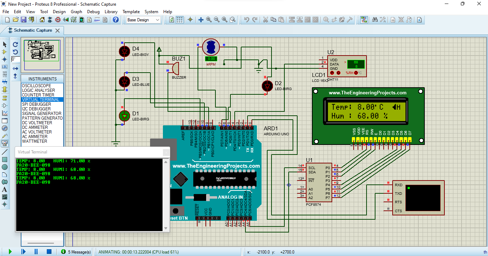
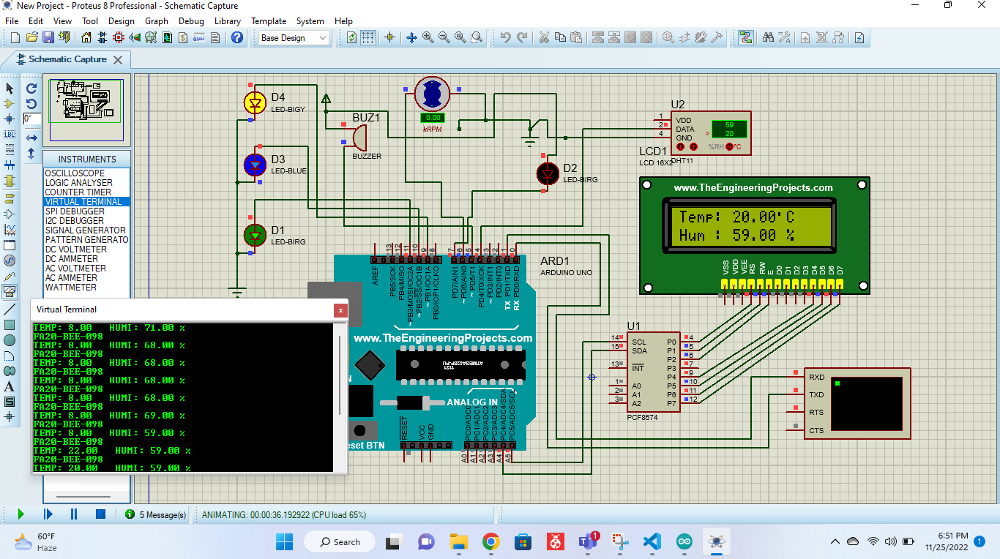

# Working of DHT11 sensor project.
The temperature is less than 25°C, the fan speed decreases, and the heater will turn on. If the temperature greaters than 25°C, the fan speed increase depends on the room temperature.

# proteus simulation

	
  

	
  

	
